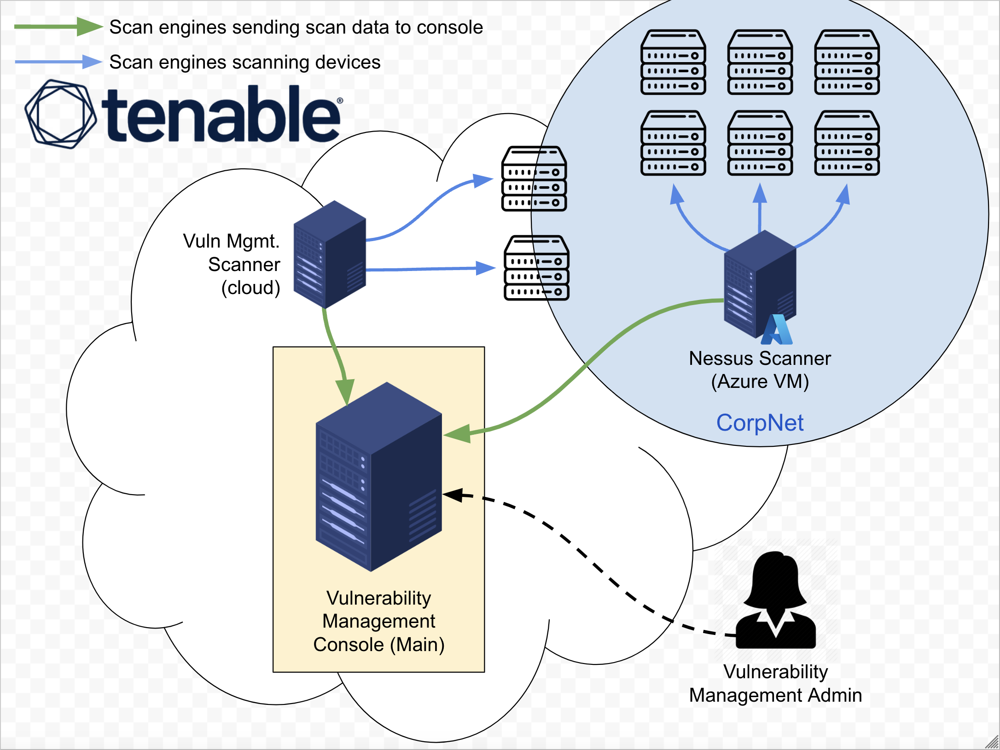
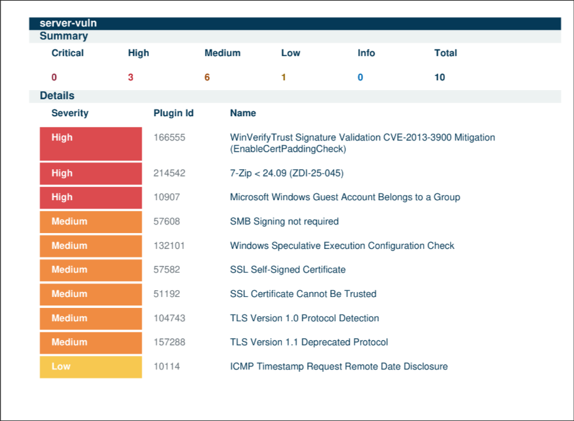
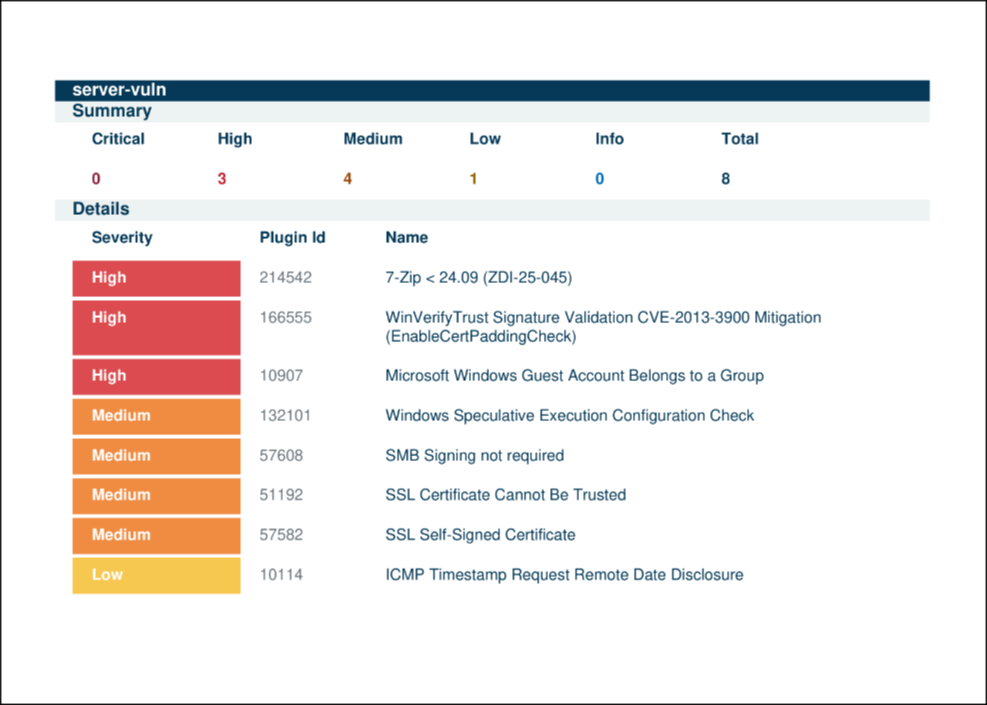
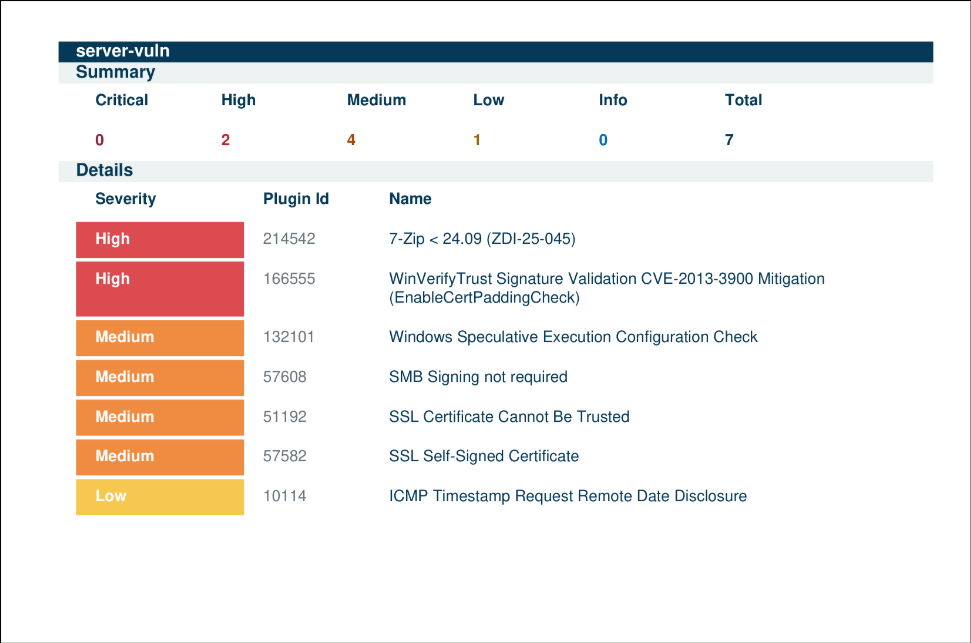
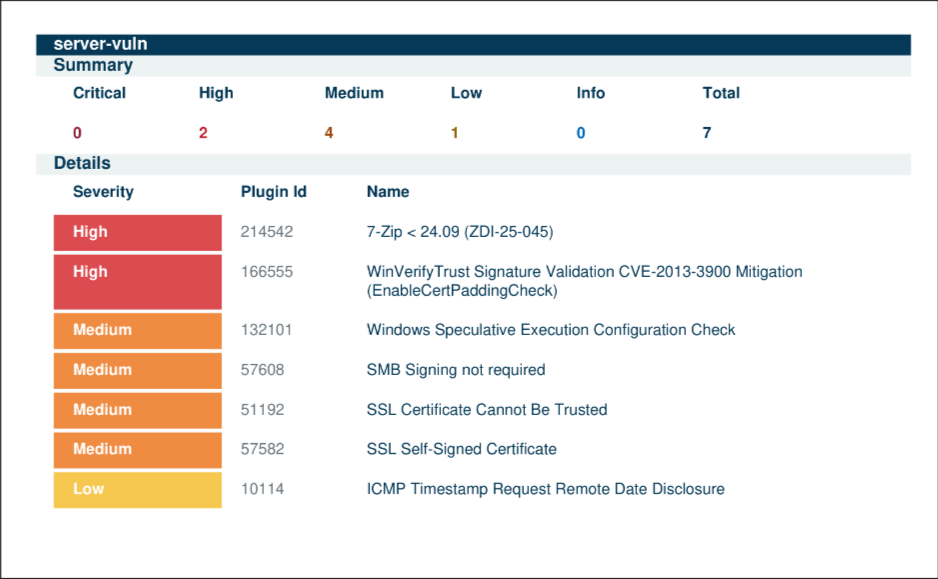

# Vuln Management Program

In this project, we'll simulate what it's like to implement a vulnerability management program.

---

# Technology Utilized
- Tenable (enterprise vulnerability management platform)
- Azure Virtual Machines (Nessus scan engine + scan targets)
- PowerShell & BASH (remediation scripts)

---

### Policy Draft Creation

In this phase, we focus on drafting a vulnerability management policy for the relevant stakeholders. It will consist of the scope, responsibilities, and remediation timelines. It may be adjusted based on feedback from relevant departments to avoid minimal disruption before it is approved by upper management.
[Draft Policy](./Vulnerability-Management-Policy-Draft.pdf)

### Step 2 Mock Meeting Stakeholders

We had a mock meeting with the server team to introduce the vulnerability management policy draft. We spoke on their capability to meet remediation timelines. The initial 48hr remediation window was too aggressive so we adjusted it to one week based on their feedback.

### Step 3 Finalize Policy and Senior leadership approves

The policy was revised based on the server team manager and has now been approved by upper management.

### Step 4 Mock Meeting: Initial Scan Permission (Sever Team)

The teams collaborate with the server team to initiate scheduled credential scans. The teams are scanning a single server first to monitor resource usage and impact on production services. They also created a secure just-in-time account just for credentialed access.

### Step 5 Initial Scan of Server Team Assets

We now deploy an insecure Windows server to simulate the server team's env. After creating vulnerabilities, an authenticated scan is performed. The results are exported for remediation steps.

[Scan 1 Initial Scan](./win-server-scan-final-cmunoz-1st-scan.pdf)

### Step 6) Vulnerability Assessment and Prioritization

We assessed vulnerabilities and established a remediation prioritization strategy based on ease of remediation and impact. The following priorities were set:

1. Third-Party Software Removal (Wireshark)
2. Windows OS Secure Configuration (Protocols & Ciphers)
3. Windows OS Secure Configuration (Guest Account Group Membership)
4. Windows OS Updates

### Step 7 Remediation Scripts

Remediation Scripts were provided to the server team to effectively remove the vulnerabilities.

### Step 8 Mock Meeting Post-Initial Scan

The server team reviewed scan results. They identified outdated software, insecure permissions and deprecated protocols. A follow-up meeting was scheduled with the Change Control Board.

### Step 9 Mock CAB Meeting: Implementing Remediations

A meeting took place where the CAB reviewed and approved the plan for the aforementioned remediations. In case of production failures, a rollback plan was developed.

### Step 10

**Remediation Round 1: Outdated Software Removal**

The team removed an outdated version of Wireshark with a PowerShell script. A follow-up scan was performed to confirm the results.

**Remediation Round 2: Insecure Protocols and Ciphers**

The team used a powershell script to remove the insecure cipher suites and ciphers and a follow-up scan was performed to validate results.

**Remediation Round 3: Insecure permissions on guest account**

The team removed the guest account from the admin group. A new scan validated the result.

**Remediation Round 4: OS updates**

Windows updates was re-enabled and the server was brought fully up-to-date. A follow-up scan was performed, but the results were the same as the previous, since the updates were minor.

### First Cycle Remediation Effort Summary

The remediation process reduced total vulnerabilities by 75%, from 28 to 6. Critical vulnerabilities were resolved by the second scan (100%), and high vulnerabilities declined by 80%. Mediums were reduced by 73%. In an actual production environment, asset criticality would further guide future remediation efforts.  

[Vuln data](./vuln-graph-progession.png)

<!-- [Remediation Data](./Vulnerability-Remediation-Progress.xlsx) -->

### On-going Vulnerability Management (Maintenance Mode)

After completing the initial remediation cycle, the vulnerability management program transitions into **Maintenance Mode**. This phase ensures that vulnerabilities continue to be managed proactively, keeping systems secure over time. Regular scans, continuous monitoring, and timely remediation are crucial components of this phase. 

Key activities in Maintenance Mode include:
- **Scheduled Vulnerability Scans**: Perform regular scans (e.g., weekly or monthly) to detect new vulnerabilities as systems evolve.
- **Patch Management**: Continuously apply security patches and updates, ensuring no critical vulnerabilities remain unpatched.
- **Remediation Follow-ups**: Address newly identified vulnerabilities promptly, prioritizing based on risk and impact.
- **Policy Review and Updates**: Periodically review the Vulnerability Management Policy to ensure it aligns with the latest security best practices and organizational needs.
- **Audit and Compliance**: Conduct internal audits to ensure compliance with the vulnerability management policy and external regulations.
- **Ongoing Communication with Stakeholders**: Maintain open communication with teams responsible for remediation, ensuring efficient coordination.

By maintaining an active vulnerability management process, organizations can stay ahead of emerging threats and ensure long-term security resilience.

